# Time Capsule - Project Roadmap

## 🗺️ Development Phases

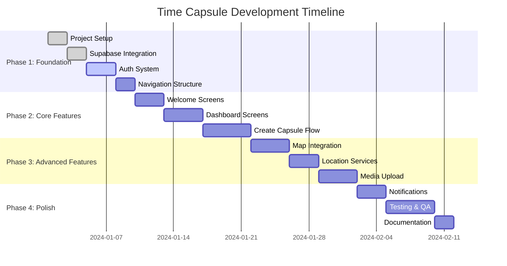

## 🏗️ System Architecture

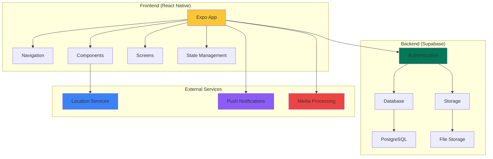

## 📱 App Navigation Flow

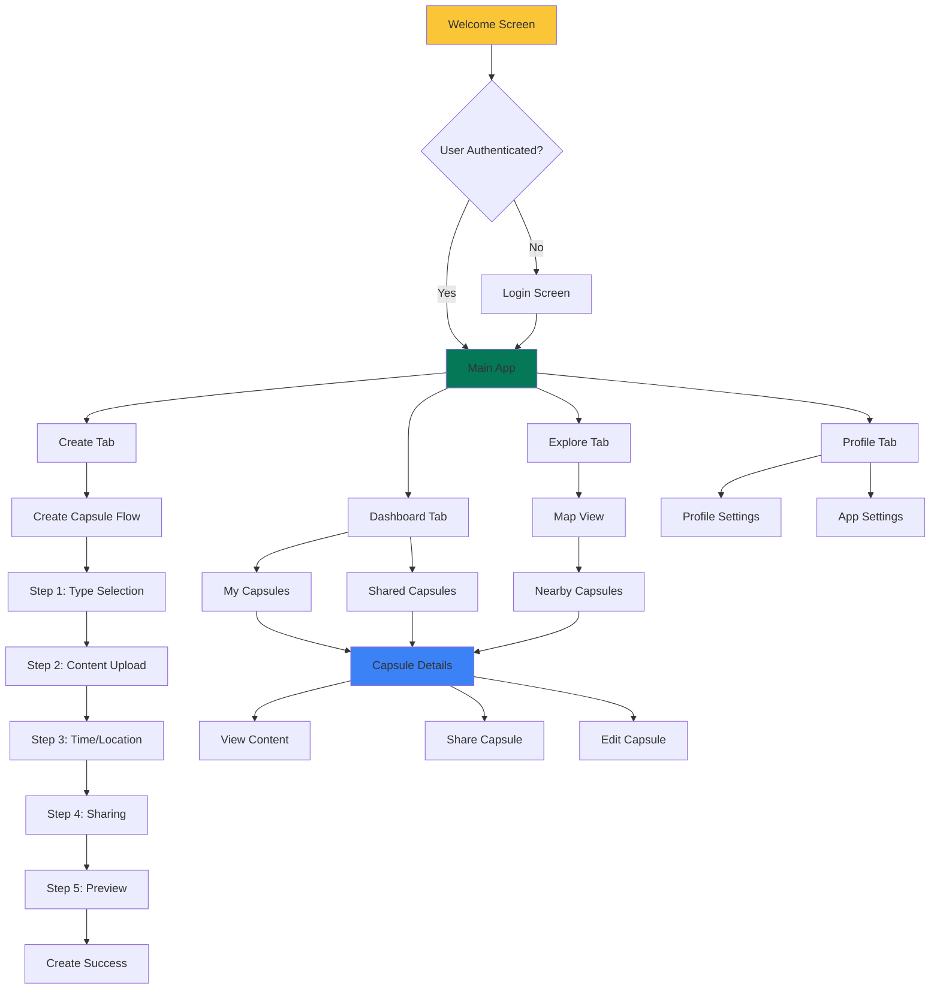

## 🗄️ Database Schema

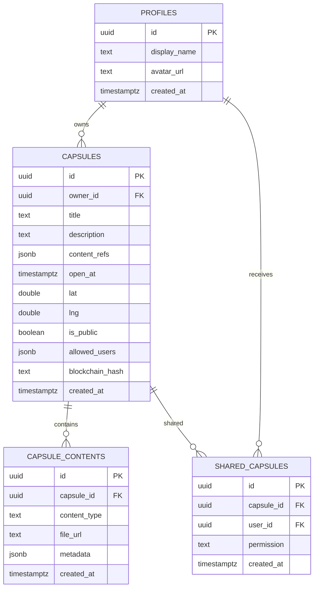

## 🔄 State Management Flow

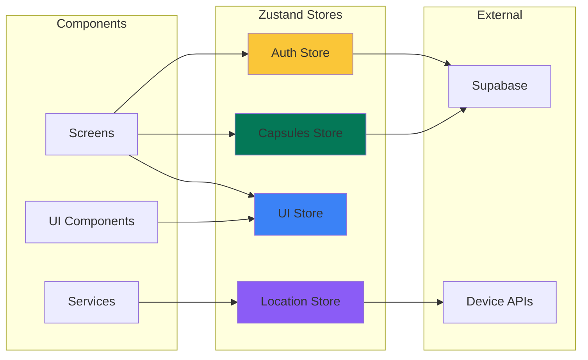

## 📊 Feature Implementation Priority

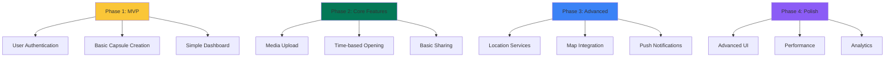

## 🧪 Testing Strategy

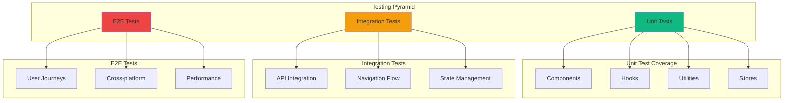

## 🚀 Deployment Pipeline

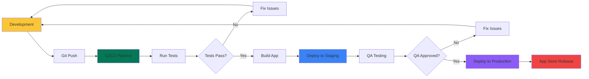

## 📈 Performance Metrics

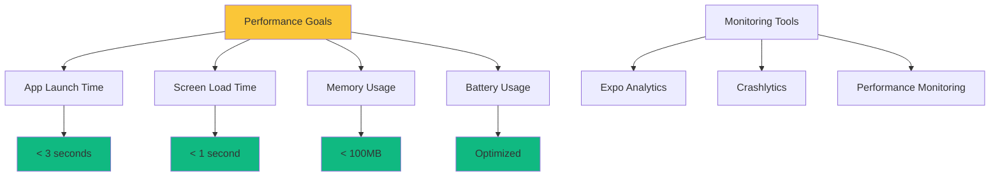

## 🔐 Security Implementation

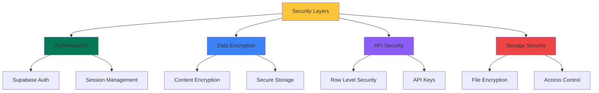

## 📱 Platform-Specific Features

```mermaid
graph LR
    subgraph "iOS Features"
        A[Face ID/Touch ID]
        B[iCloud Sync]
        C[Apple Maps]
        D[Push Notifications]
    end
    
    subgraph "Android Features"
        E[Fingerprint Auth]
        F[Google Drive Sync]
        G[Google Maps]
        H[Push Notifications]
    end
    
    subgraph "Cross-Platform"
        I[Email Auth]
        J[Supabase Storage]
        K[React Native Maps]
        L[Expo Notifications]
    end
    
    A --> I
    E --> I
    B --> J
    F --> J
    C --> K
    G --> K
    D --> L
    H --> L
    
    style A fill:#000000
    style E fill:#3DDC84
    style I fill:#FAC638
```

## 🎯 Success Metrics

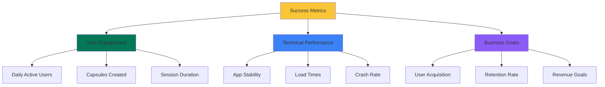

This roadmap provides a comprehensive overview of the Time Capsule project development, including timelines, architecture, and implementation strategies. The visual diagrams help clarify the complex relationships between different components and phases of the project.